# Glide HTPC Remote — System Documentation

> Living architecture document. Generated during initial build. Update as the system evolves.

---

## Table of Contents

- [1. System Overview](#1-system-overview)
- [2. Component Architecture](#2-component-architecture)
- [3. Connection Flow](#3-connection-flow)
- [4. Input Backend — X11 vs Wayland](#4-input-backend--x11-vs-wayland)
- [5. WebSocket Protocol](#5-websocket-protocol)
- [6. Mobile UI — Screen Breakdown](#6-mobile-ui--screen-breakdown)
- [7. Trackpad Touch Logic](#7-trackpad-touch-logic)
- [8. Scroll Strip](#8-scroll-strip)
- [9. Drawer System](#9-drawer-system)
- [10. GTK Overlay — HTPC Screen Popup](#10-gtk-overlay--htpc-screen-popup)
- [11. Shared State — Overlay ↔ Server](#11-shared-state--overlay--server)
- [12. Project File Structure](#12-project-file-structure)
- [13. Debian Package](#13-debian-package)
- [14. postinst — What Happens on Install](#14-postinst--what-happens-on-install)
- [15. systemd User Service](#15-systemd-user-service)
- [16. Build & Release](#16-build--release)
- [17. Deploy to HTPC](#17-deploy-to-htpc)
- [18. App Launcher Configuration](#18-app-launcher-configuration)
- [19. Logs & Troubleshooting](#19-logs--troubleshooting)
- [20. Key Design Decisions](#20-key-design-decisions)

---

## 1. System Overview

Glide is a self-hosted HTPC remote control system. The HTPC runs a Python server as a systemd user service. On boot it displays a GTK popup showing a QR code. Scanning the code with a phone opens the Glide web UI in any browser — no app install required. The phone and HTPC communicate over a WebSocket on the local network. The server translates incoming messages into real mouse and keyboard events using the appropriate driver for the active display server (X11 or Wayland).

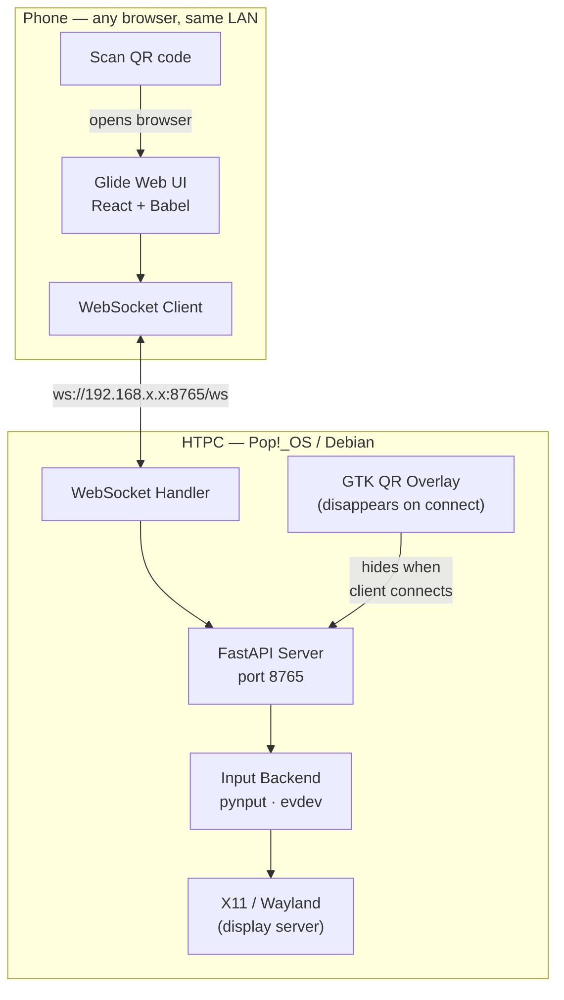

---

## 2. Component Architecture

The server process runs two concurrent threads. The GTK overlay occupies the main thread (GTK's requirement). FastAPI / uvicorn runs in a daemon thread with its own asyncio event loop. They share an `AppState` object protected by a threading lock. GTK updates are always scheduled via `GLib.idle_add` to keep them on the main thread.

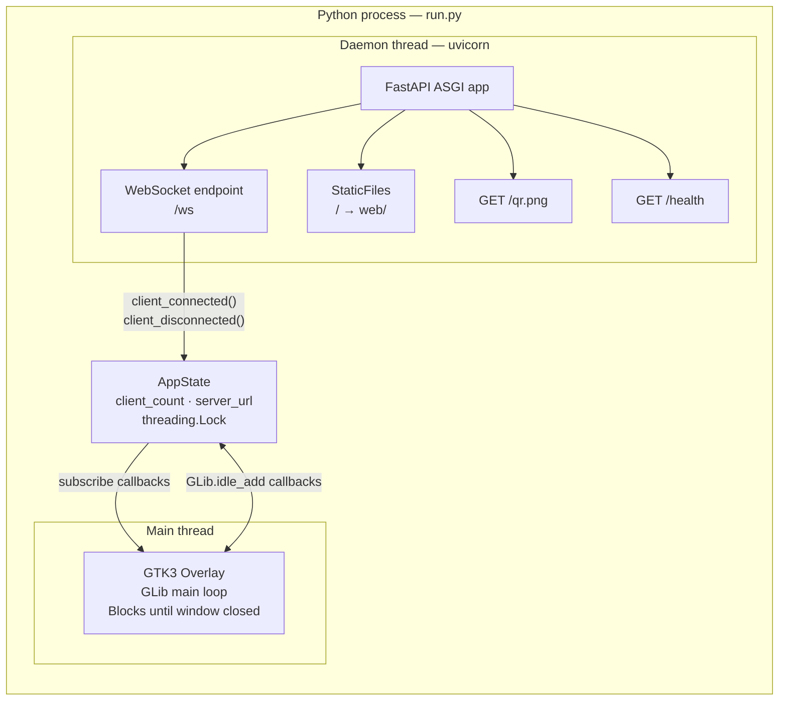

---

## 3. Connection Flow

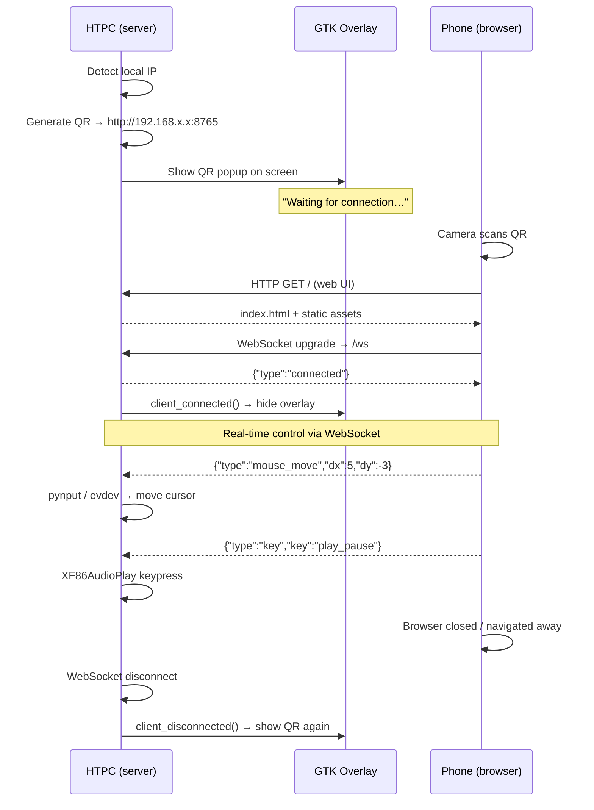

---

## 4. Input Backend — X11 vs Wayland

The backend is selected once at startup by reading `$XDG_SESSION_TYPE`. Both backends expose the same abstract interface so the rest of the server never needs to know which one is active.

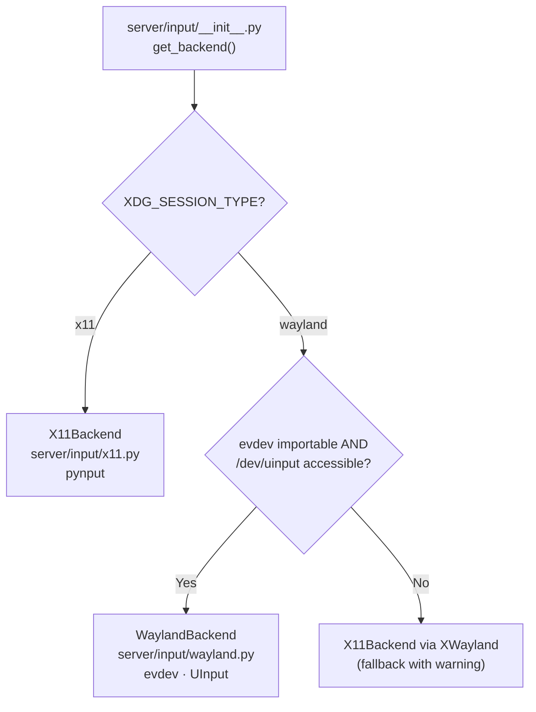

### X11 Backend — key mapping

Uses pynput with raw XF86 keysyms so media keys work across all desktop environments regardless of theme or shortcut config.

| Action | XF86 Keysym | Hex |
|---|---|---|
| Play / Pause | XF86AudioPlay | `0x1008FF14` |
| Stop | XF86AudioStop | `0x1008FF15` |
| Next | XF86AudioNext | `0x1008FF17` |
| Previous | XF86AudioPrev | `0x1008FF16` |
| Volume Up | XF86AudioRaiseVolume | `0x1008FF13` |
| Volume Down | XF86AudioLowerVolume | `0x1008FF11` |
| Mute | XF86AudioMute | `0x1008FF12` |
| Seek Back | XF86AudioRewind | `0x1008FF3E` |
| Seek Forward | XF86AudioForward | `0x1008FF97` |
| Sleep | XF86Sleep | `0x1008FF2F` |
| Fullscreen | F11 | — |

### Wayland Backend — uinput setup

Creates a virtual `/dev/uinput` device at startup using `evdev.UInput`. The device is named `htpc-remote` and advertises exactly the capabilities it uses (EV_REL for mouse, EV_KEY for all button/key actions). The postinst script adds the user to the `input` group and installs a udev rule so the device is accessible without root.

```
/etc/udev/rules.d/99-htpc-remote.rules:
KERNEL=="uinput", GROUP="input", MODE="0660", OPTIONS+="static_node=uinput"
```

### Text input strategy

| Session | Method | Fallback |
|---|---|---|
| X11 | `pynput.keyboard.Controller.type()` | — |
| Wayland | `wtype <text>` | `ydotool type` → clipboard paste via `wl-copy` + Ctrl+V |

---

## 5. WebSocket Protocol

All messages are JSON. The phone sends, the server receives and acts. The server sends only one message (welcome on connect).

### Phone → Server

| `type` | Fields | Action |
|---|---|---|
| `mouse_move` | `dx: float, dy: float` | Move cursor by relative delta |
| `mouse_click` | `button: "left" \| "right" \| "middle"` | Single click |
| `scroll` | `dy: float` | Scroll — positive = down, negative = up |
| `key` | `key: string` | Press a named key (see table below) |
| `text` | `text: string` | Type a string via keyboard |
| `launch` | `app: string` | Launch an app by name |

### Named keys

| `key` value | Action |
|---|---|
| `play_pause` | Toggle playback |
| `stop` | Stop playback |
| `next` / `prev` | Skip track |
| `seek_fwd` / `seek_back` | Seek ±10 s |
| `volume_up` / `volume_down` | Volume step |
| `mute` | Toggle mute |
| `fullscreen` | F11 |
| `up` / `down` / `left` / `right` | Arrow keys |
| `ok` | Enter |
| `esc` | Escape |
| `tab` | Tab |
| `backspace` | Backspace |
| `enter` | Enter / Return |
| `sleep` | System sleep |

### Server → Phone

```json
{ "type": "connected" }
```

Sent immediately on WebSocket handshake. Reserved for future server-push events (volume level sync, track info, etc.).

### Bandwidth optimisation

Mouse move messages are batched client-side using `requestAnimationFrame`. All pointer events within a single frame are accumulated into one delta pair and sent as a single message — effectively capping the send rate at the screen refresh rate (~60 fps) regardless of how fast `pointermove` fires.

---

## 6. Mobile UI — Screen Breakdown

The UI is a React 18 app transpiled in-browser by Babel standalone (no build step). All dependencies (React, ReactDOM, Babel) are served locally from `/static/` so the app works fully offline on the LAN.

```
┌─────────────────────────────────────┐
│ ● Living-Room PC    connected · ms  │  ← Header (status dot + device name)
│                                  🔗 │
├──────────────────────────┬──────────┤
│                          │  ↑       │
│                          │  ─────   │
│    Trackpad              │  ─────   │  ← Scroll strip (right side)
│    (flex: 1)             │  ─────   │
│                          │  ─────   │
│    Drag to move          │  ─────   │
│    tap = click           │  ↓       │
│    hold = right-click    │ SCROLL   │
├──────┬──────┬────────────┴──────────┤
│ Left │ Mid  │         Right         │  ← Click buttons
├──────┴──────┴───────────────────────┤
│           ────── (handle)           │  ← Swipe-up / tap to open drawer
├─────┬──────┬──────┬──────┬──────────┤
│  ⌨  │  ▶  │  🔉  │  🔊  │   ⊞     │  ← Quick action bar
└─────┴──────┴──────┴──────┴──────────┘
```

### Screens

| Screen | Trigger | Description |
|---|---|---|
| **Connecting** | Page load (WS not yet open) | Spinner + "reaching host" |
| **Connected** | WS handshake succeeds | Tick animation, 1.3 s then advances |
| **Controller** | After connected animation | Full remote UI |
| **Reconnecting** | WS drops mid-session | Status dot turns amber, no UI interruption |

---

## 7. Trackpad Touch Logic

The trackpad uses Pointer Events (works for both mouse and touch). `touch-action: none` is set on the element to prevent the browser consuming touch events for scroll or zoom.

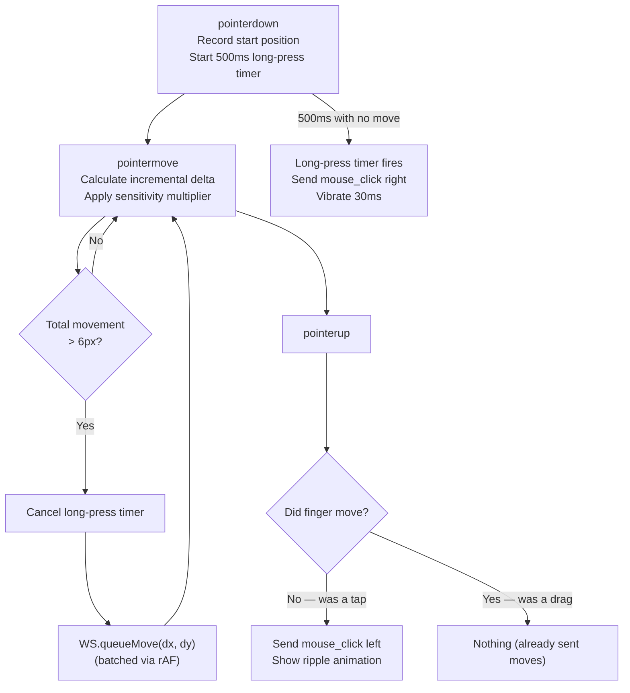

### Sensitivity

Pointer sensitivity is a multiplier applied to the raw pixel delta before sending. Default is 2.0×. Adjustable from the **Tune** drawer (0.5× – 4.0× range). The value is stored in `window.HTPC.sensitivity` client-side — no server round-trip needed.

---

## 8. Scroll Strip

A dedicated vertical strip on the right side of the trackpad replaces the unreliable two-finger scroll gesture (which mobile browsers intercept for pinch-zoom). The strip tracks single-finger drag and sends `scroll` events proportional to movement. A visual thumb indicator follows the finger.

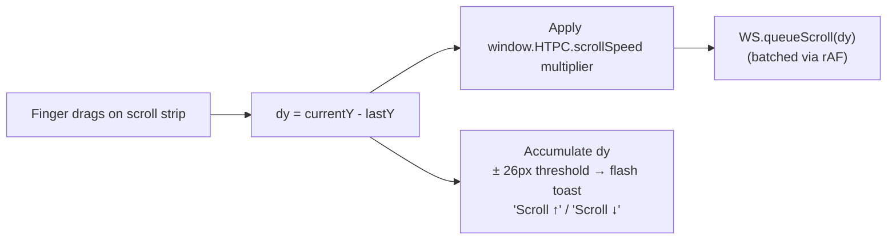

---

## 9. Drawer System

Swiping up from the pill handle (or tapping it) opens a frosted-glass sheet anchored to the bottom of the screen. The sheet contains four tabs.

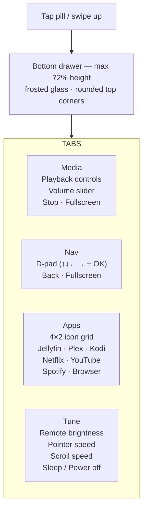

### App launcher

Tapping an app icon sends `{ "type": "launch", "app": "jellyfin" }`. The server resolves the app name against `APP_COMMANDS` in `server/input/base.py` and launches via `subprocess.Popen(..., start_new_session=True)`. The session is detached so it survives even if the server restarts.

```python
APP_COMMANDS = {
    "jellyfin": "xdg-open http://localhost:8096",
    "plex":     "xdg-open https://app.plex.tv",
    "kodi":     ["kodi", "flatpak run tv.kodi.Kodi"],   # tries in order
    "netflix":  "xdg-open https://www.netflix.com",
    "youtube":  "xdg-open https://www.youtube.com",
    "spotify":  ["spotify", "flatpak run com.spotify.Client"],
    "browser":  ["xdg-open https://", "firefox", "chromium-browser"],
}
```

---

## 10. GTK Overlay — HTPC Screen Popup

The overlay is a GTK3 borderless window that stays above all other windows (`set_keep_above(True)`). It renders the QR code using a GdkPixbuf loaded from the PNG generated by the `qrcode` library. When a phone connects the overlay hides. When all phones disconnect it reappears and regenerates the QR.

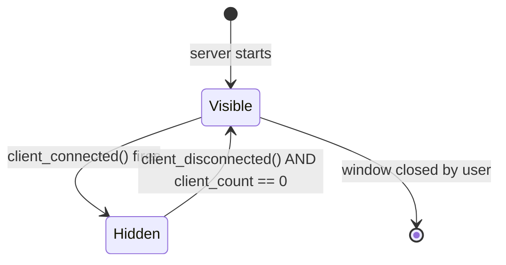

### Fallback

If `python3-gi` (PyGObject) is not available the overlay module falls back to printing the URL to stdout and blocking on `time.sleep(1)`. The URL still appears in `journalctl` and the WebSocket server still works — only the on-screen popup is missing.

---

## 11. Shared State — Overlay ↔ Server

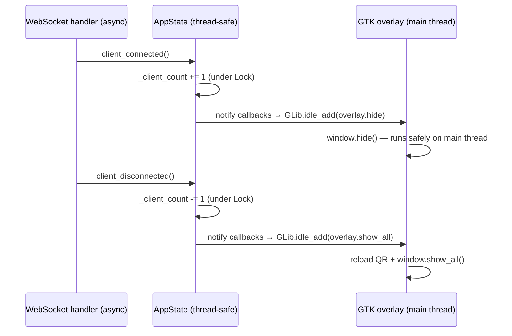

`GLib.idle_add` is the standard GTK mechanism for scheduling work from a non-GTK thread onto the GTK main loop. Without it, calling GTK methods from the uvicorn thread would cause race conditions or crashes.

---

## 12. Project File Structure

```
htpc-remote/
│
├── run.py                          Entry point
│
├── server/
│   ├── main.py                     Wires backend, state, overlay, uvicorn
│   ├── app.py                      FastAPI app — routes + WebSocket handler
│   ├── state.py                    AppState (thread-safe, pub/sub callbacks)
│   ├── network.py                  Local IP detection, QR PNG generation
│   ├── overlay.py                  GTK3 QR popup + terminal fallback
│   └── input/
│       ├── __init__.py             Backend factory — reads XDG_SESSION_TYPE
│       ├── base.py                 Abstract InputBackend + APP_COMMANDS
│       ├── x11.py                  pynput implementation (XF86 keysyms)
│       └── wayland.py              evdev/UInput implementation
│
├── web/
│   ├── index.html                  React shell — loads all static assets
│   └── static/
│       ├── glide-tokens.css        Design tokens (OLED dark, Pop!_OS teal)
│       ├── glide-ui.jsx            Icon set (GIcon) + GSlider primitive
│       ├── glide-connect.jsx       Connect flow: connecting → connected → controller
│       ├── glide-controller.jsx    Full controller UI — all WS calls wired
│       ├── ws.js                   WebSocket manager + HTPC config object
│       ├── react.min.js            React 18 UMD (served locally — offline safe)
│       ├── react-dom.min.js        ReactDOM 18 UMD
│       └── babel.min.js            Babel standalone (in-browser JSX transform)
│
├── packaging/
│   └── DEBIAN/
│       ├── control                 Package metadata + dependencies
│       ├── postinst                Post-install: venv, udev, input group, service enable
│       ├── prerm                   Pre-remove: stop + disable service
│       └── postrm                  Post-remove: purge /opt/htpc-remote on purge
│
├── systemd/
│   └── htpc-remote.service         Reference copy (the .deb installs to /usr/lib/systemd/user/)
│
├── build-deb.sh                    Builds .deb via debian:bookworm-slim Docker container
├── requirements.txt                Python pip dependencies
└── htpc-remote_x.y.z_all.deb      Pre-built package (latest)
```

---

## 13. Debian Package

The `.deb` installs to three locations:

| Path | Contents |
|---|---|
| `/opt/htpc-remote/` | All application files (server, web, venv created by postinst) |
| `/usr/lib/systemd/user/htpc-remote.service` | systemd user service unit |
| `/etc/udev/rules.d/99-htpc-remote.rules` | udev rule for `/dev/uinput` |

### Package metadata

| Field | Value |
|---|---|
| Package | `htpc-remote` |
| Architecture | `all` (pure Python, no compiled extensions) |
| Depends | `python3 (≥ 3.9)`, `python3-gi`, `python3-gi-cairo`, `gir1.2-gtk-3.0`, `xdotool` |
| Pre-Depends | `python3-pip`, `python3-venv` |
| Recommends | `wtype`, `brightnessctl` |

`Pre-Depends` ensures pip and venv are available before postinst runs (postinst builds the virtualenv).

---

## 14. postinst — What Happens on Install

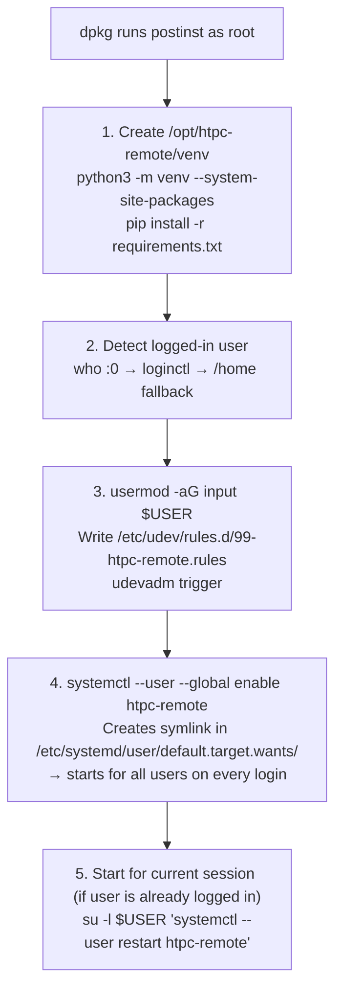

`--system-site-packages` on the venv lets it use the system-installed `python3-gi` (GTK bindings) without re-installing them via pip.

---

## 15. systemd User Service

```ini
[Unit]
Description=HTPC Remote Control Server (Glide)
After=network-online.target graphical-session.target
Wants=network-online.target

[Service]
Type=simple
WorkingDirectory=/opt/htpc-remote
ExecStart=/opt/htpc-remote/venv/bin/python /opt/htpc-remote/run.py
Restart=on-failure
RestartSec=5
Environment="PYTHONUNBUFFERED=1"

[Install]
WantedBy=default.target
```

### Key points

- **User service** — runs as the logged-in user automatically. No root. No hardcoded username.
- `After=graphical-session.target` — waits for the display session to be fully initialised before starting. Guarantees `DISPLAY` / `WAYLAND_DISPLAY` and `XDG_SESSION_TYPE` are set.
- `Restart=on-failure` — automatically recovers from crashes. `RestartSec=5` prevents a tight restart loop.
- `WantedBy=default.target` — starts as part of the normal user session. Because postinst runs `--global enable`, this applies to every user on the machine.

### Service lifecycle on auto-login HTPC

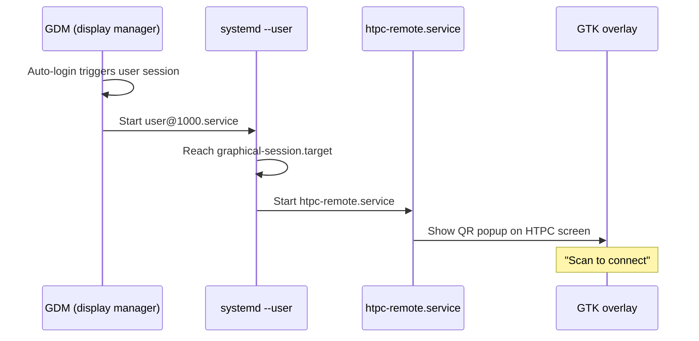

---

## 16. Build & Release

The `build-deb.sh` script uses a `debian:bookworm-slim` Docker container to run `dpkg-deb`. This means the `.deb` is always built in a clean Debian environment regardless of what OS you're building on.

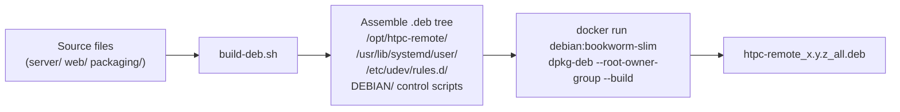

### Cut a new release

```bash
# 1. Make your changes and commit
git add . && git commit -m "description"

# 2. Build the .deb (version argument optional, defaults to 1.0.0)
bash build-deb.sh 1.1.0

# 3. Commit the new .deb and push
git add htpc-remote_1.1.0_all.deb packaging/DEBIAN/control
git commit -m "Release 1.1.0"
git push
```

---

## 17. Deploy to HTPC

### First install

```bash
# From your dev machine
scp htpc-remote_1.0.1_all.deb darren@192.168.10.158:~/Desktop/

ssh darren@192.168.10.158 \
  'echo "password" | sudo -S apt install -y ~/Desktop/htpc-remote_1.0.1_all.deb'
```

### Upgrade (in-place)

```bash
scp htpc-remote_1.1.0_all.deb darren@192.168.10.158:~/

ssh darren@192.168.10.158 \
  'echo "password" | sudo -S apt install -y ~/htpc-remote_1.1.0_all.deb'
```

`apt install ./file.deb` on an already-installed package performs an upgrade — postinst re-runs, the venv is rebuilt, and the service is restarted.

### Uninstall

```bash
sudo apt remove htpc-remote       # removes package, keeps /opt/htpc-remote
sudo apt purge  htpc-remote       # removes everything including /opt/htpc-remote
```

---

## 18. App Launcher Configuration

The app list lives in `server/input/base.py` in the `APP_COMMANDS` dict. Values can be a single shell command string or a list (tried in order, first one whose binary exists is used).

```python
APP_COMMANDS: dict[str, str | list[str]] = {
    "jellyfin": "xdg-open http://localhost:8096",
    "plex":     "xdg-open https://app.plex.tv",
    "kodi":     ["kodi", "flatpak run tv.kodi.Kodi"],
    "netflix":  "xdg-open https://www.netflix.com",
    "youtube":  "xdg-open https://www.youtube.com",
    "spotify":  ["spotify", "flatpak run com.spotify.Client"],
    "browser":  ["xdg-open https://", "firefox", "chromium-browser"],
}
```

The UI app grid (`DrawerApps` in `glide-controller.jsx`) maps names to colours using `oklch` hues. To add a new app, add an entry to both `APP_COMMANDS` and the `APPS` array in the JSX:

```javascript
const APPS = [
    ['J', 'Jellyfin',  285],  // [icon-letter, name, hue]
    ['P', 'Plex',       60],
    // ...
    ['E', 'Emby',      160],  // new entry
];
```

Then rebuild and redeploy.

---

## 19. Logs & Troubleshooting

### Common commands (run on the HTPC)

```bash
# Service status
systemctl --user status htpc-remote

# Live logs
journalctl --user -u htpc-remote -f

# Restart
systemctl --user restart htpc-remote

# Check what session type is active
echo $XDG_SESSION_TYPE

# Check uinput permissions (Wayland)
ls -l /dev/uinput
groups $USER | grep input
```

### Troubleshooting guide

| Symptom | Likely cause | Fix |
|---|---|---|
| QR popup doesn't appear | GTK not available or DISPLAY not set | Check `journalctl` for overlay error. Confirm `DISPLAY=:0` is in the process env. |
| Phone can't reach the server | Firewall blocking port 8765 | `sudo ufw allow 8765` |
| Mouse moves but wrong speed | Sensitivity too high/low | Adjust in Tune drawer on the phone |
| Wayland: mouse doesn't move | User not in `input` group or uinput rule missing | Log out and back in after install. Check `/dev/uinput` permissions. |
| Text input doesn't work on Wayland | `wtype` not installed | `sudo apt install wtype` |
| Service doesn't start on login | Global enable didn't apply | `systemctl --user --global enable htpc-remote` |
| App launcher does nothing | App binary not found on PATH | Check `APP_COMMANDS` for the app, ensure binary is installed |

---

## 20. Key Design Decisions

### No two-finger scroll
Mobile browsers capture two-finger gestures for pinch-to-zoom. There is no reliable way to intercept them. The dedicated scroll strip on the right side of the trackpad uses single-finger drag instead, which is fully under the app's control.

### No app install required
The phone UI is a standard browser page — no PWA manifest, no Play Store, no App Store. Any phone on the same network can connect by opening the QR URL.

### React + Babel in-browser
There is no build step. React, ReactDOM and Babel standalone are served as static files from the same Python server. This keeps the project deployable as a single `.deb` with no Node.js toolchain required. Babel transpiles the JSX at load time in the browser — acceptable for a LAN-only app where load time is measured in milliseconds.

### React served locally (not CDN)
CDN scripts were originally used but failed in network-restricted environments. All JS dependencies are bundled into `web/static/` so the app works fully offline once installed. The total added weight is ~3.3 MB (dominated by Babel standalone).

### User service, not system service
A systemd user service runs as the logged-in user automatically with full access to the display session (`DISPLAY`, `XDG_SESSION_TYPE`, `XDG_RUNTIME_DIR`). A system service with a hardcoded `User=` would require knowing the username at package build time and would need explicit display environment injection.

### Single abstraction layer for X11/Wayland
Both backends implement the same `InputBackend` ABC. The selection happens once at startup via the factory in `__init__.py`. All upstream code (`app.py`, `main.py`) only ever holds a reference to `InputBackend` — switching display servers requires zero changes outside the `input/` package.

### GTK on the main thread
GTK's main loop is not thread-safe. All GTK calls must happen on the thread that called `Gtk.main()`. Cross-thread communication to the overlay uses `GLib.idle_add()` which schedules the callback safely on the GTK event loop. uvicorn runs in a daemon thread with its own asyncio event loop and never touches GTK directly.
