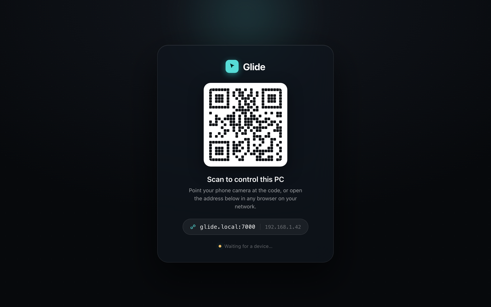
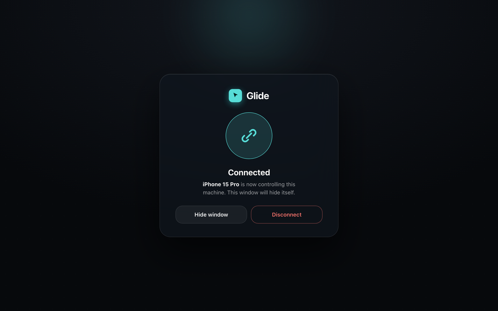
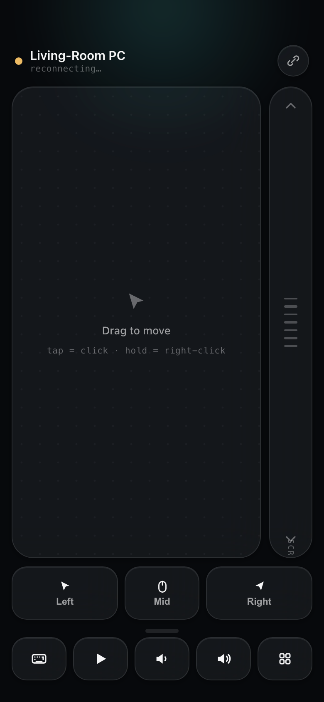
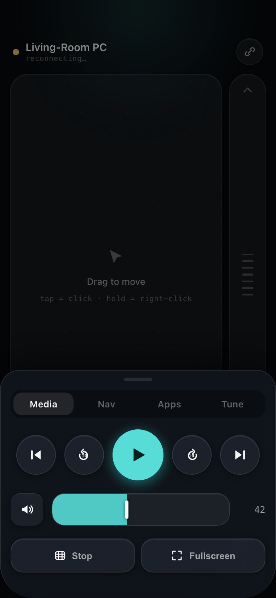
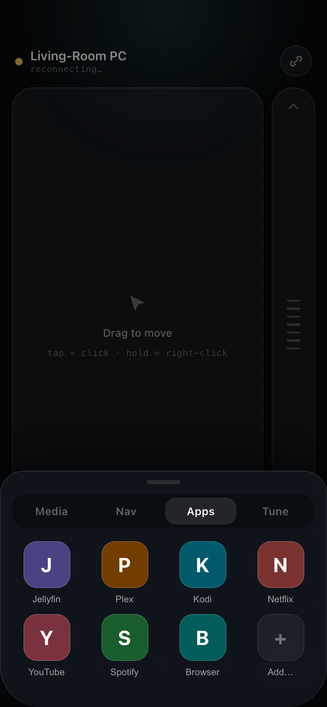
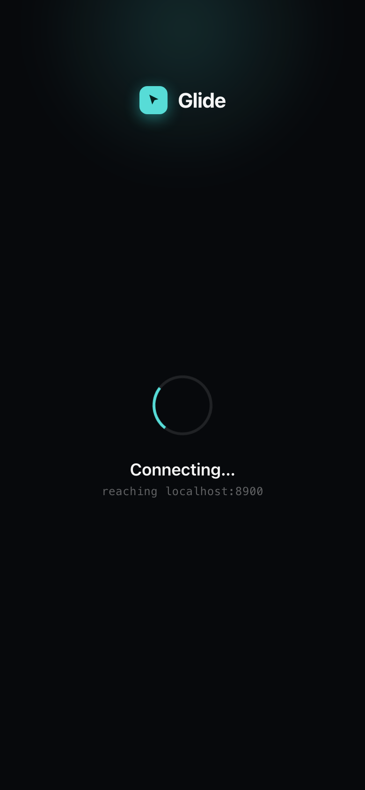

# Glide — HTPC Remote Control

> Turn any phone into a polished remote for your home theatre PC.  
> Scan a QR code. No app install. No pairing codes. Just works.



---

## What it does

Glide runs as a **systemd user service** on your HTPC (Pop!\_OS / Debian). When you log in, a glassmorphic popup appears on screen showing a QR code. Scan it with your phone — any browser on the same network will do — and you're in control. The popup disappears, your phone becomes the remote.

- **Trackpad** with tap-to-click and a dedicated scroll strip (no flaky two-finger gestures)
- **Media controls** — play/pause, seek ±10s, next/prev, volume, mute, fullscreen
- **D-pad navigation** for Kodi, Netflix, anything full-screen
- **App launcher** — one tap to open Jellyfin, Plex, Kodi, Spotify, YouTube, browser
- **Text input** — native mobile keyboard, sends text directly to the focused field
- **Tune panel** — adjust pointer speed, scroll speed, and screen brightness from the remote
- **X11 and Wayland** — auto-detected at startup, no config needed

---

## Screenshots

<table>
<tr>
<td align="center" width="50%">

**HTPC — waiting for connection**


*Appears on login. Scan or type the URL.*

</td>
<td align="center" width="50%">

**HTPC — phone connected**



*Confirms which device took control. Auto-hides.*

</td>
</tr>
<tr>
<td align="center" width="50%">

**Phone — trackpad view**



*Drag to move. Tap to click. Right strip scrolls.*

</td>
<td align="center" width="50%">

**Phone — media controls**



*Swipe up or tap ⊞ to open. Prev / seek / play / seek / next + volume.*

</td>
</tr>
<tr>
<td align="center" width="50%">

**Phone — app launcher**



*One tap launches Jellyfin, Plex, Kodi, Netflix, YouTube, Spotify, or browser.*

</td>
<td align="center" width="50%">

**Phone — connecting**



*What you see the moment you open the URL. WebSocket connects automatically.*

</td>
</tr>
</table>

---

## Requirements

| | |
|---|---|
| **HTPC OS** | Pop!\_OS 22.04 or any Debian/Ubuntu ≥ 20.04 |
| **Display server** | X11 or Wayland (auto-detected) |
| **Python** | 3.9+ |
| **Phone** | Any browser on the same network — iOS Safari, Android Chrome, anything |

Runtime packages installed automatically by the `.deb`:

```
python3-gi  python3-gi-cairo  gir1.2-gtk-3.0  xdotool
```

Optional (recommended for Wayland text input):

```
wtype  brightnessctl
```

---

## Install

### Option A — pre-built `.deb` (recommended)

Download the latest release and copy it to your HTPC:

```bash
# From your Mac/PC
scp htpc-remote_1.0.1_all.deb darren@192.168.1.x:/home/darren/

# On the HTPC
sudo apt install ./htpc-remote_1.0.1_all.deb
```

The installer will:
1. Create a Python virtual environment at `/opt/htpc-remote/venv`
2. Install FastAPI, uvicorn, pynput (X11) or evdev (Wayland)
3. Add a udev rule so the Wayland backend can write to `/dev/uinput`
4. Enable the systemd user service for auto-start on login

Log out and back in (or reboot). The popup will appear on your next login.

### Option B — build the `.deb` yourself

You need Docker installed on your build machine:

```bash
git clone https://github.com/dnaidoo621/htpc-remote
cd htpc-remote
bash build-deb.sh          # produces htpc-remote_1.0.0_all.deb
bash build-deb.sh 1.0.1    # custom version
```

The build runs inside `debian:bookworm-slim` so your host OS doesn't matter.

---

## Usage

### Connecting from your phone

Once the service is running you'll see the QR popup on your TV/monitor. You have two options:

- **Scan the QR code** with your phone camera — it opens the URL automatically
- **Type the URL** shown under the code (e.g. `glide.local:7000` or `192.168.1.42:7000`) into any browser

The popup disappears once your phone connects. To reconnect, reload the browser tab.

### Controls at a glance

| Gesture / button | Action |
|---|---|
| Drag on trackpad | Move mouse cursor |
| Tap on trackpad | Left click |
| Drag on scroll strip (right side) | Scroll |
| ▶ / ⏸ quick button | Play / Pause |
| 🔉 / 🔊 quick buttons | Volume down / up |
| ⊞ button → Media tab | Full media controls + seek |
| ⊞ button → Nav tab | D-pad + Back + Fullscreen |
| ⊞ button → Apps tab | App launcher |
| ⊞ button → Tune tab | Speed, brightness, sleep |
| ⌨ button | Open keyboard for text input |

---

## App launcher

Out of the box the launcher supports:

| App | How it opens |
|---|---|
| Jellyfin | `xdg-open http://localhost:8096` |
| Plex | `xdg-open https://app.plex.tv` |
| Kodi | `kodi` binary, or Flatpak fallback |
| Netflix | `xdg-open https://www.netflix.com` |
| YouTube | `xdg-open https://www.youtube.com` |
| Spotify | `spotify` binary, or Flatpak fallback |
| Browser | `firefox` → `chromium-browser` → `xdg-open` |

To customise, edit `APP_COMMANDS` in `/opt/htpc-remote/server/input/base.py`.

---

## Service management

The service runs as your user, not root:

```bash
# Status
systemctl --user status htpc-remote

# Restart
systemctl --user restart htpc-remote

# Live logs
journalctl --user -u htpc-remote -f

# Disable auto-start
systemctl --user disable htpc-remote
```

---

## X11 vs Wayland

Glide detects `$XDG_SESSION_TYPE` at startup and loads the right backend automatically.

| | X11 | Wayland |
|---|---|---|
| Mouse / click | pynput | evdev / uinput |
| Media keys | XF86 keysyms via pynput | Linux keycodes via evdev |
| Text input | pynput type | wtype → ydotool → wl-copy |
| Extra setup | None | `/dev/uinput` group (done by installer) |

If you switch display servers, just restart the service — no reinstall needed.

---

## Troubleshooting

**Popup doesn't appear on login**

```bash
# Check the service
systemctl --user status htpc-remote
journalctl --user -u htpc-remote -b --no-pager
```

Most common cause: `DISPLAY` or `WAYLAND_DISPLAY` not set in the service environment. The installer sets these via `systemctl --user set-environment`, but a reboot usually fixes it.

**Phone can't reach the server**

- Make sure phone and HTPC are on the same network
- Check the firewall: `sudo ufw allow 7000/tcp`
- Confirm the service is listening: `ss -tlnp | grep 7000`

**Wayland: mouse moves but keyboard/media keys don't work**

```bash
# Check uinput group
groups $USER  # should include 'input'

# If not, add and re-login
sudo usermod -aG input $USER
```

**Text input (Wayland) doesn't work**

Install `wtype`: `sudo apt install wtype`

---

## How it works

```
Phone browser  ──WebSocket──▶  FastAPI server (port 7000)
                                       │
                      ┌────────────────┴─────────────────┐
                      ▼                                   ▼
               X11 (pynput)                     Wayland (evdev/uinput)
               XF86 keysyms                     Linux keycodes
```

The server translates incoming WebSocket messages into real input events using the active display server's native API. The GTK popup is driven by the same server via a shared state object — when a WebSocket client connects, the popup hides; when it disconnects, the popup reappears.

Full architecture docs: [README.md §1–20](#table-of-contents)

---

## Build & project structure

```
htpc-remote/
├── server/
│   ├── app.py          FastAPI + WebSocket handler
│   ├── overlay.py      GTK3 QR popup
│   ├── main.py         Entry point (uvicorn thread + GTK main loop)
│   └── input/
│       ├── base.py     InputBackend ABC + APP_COMMANDS
│       ├── x11.py      pynput backend
│       └── wayland.py  evdev/uinput backend
├── web/
│   ├── index.html      Mobile UI entry point
│   └── static/
│       ├── glide-tokens.css     Design tokens (OLED dark, Pop!_OS teal)
│       ├── glide-ui.jsx         Icon set + shared primitives
│       ├── glide-connect.jsx    WS connection flow
│       ├── glide-controller.jsx Full controller UI
│       └── ws.js                WebSocket manager + rAF batching
├── packaging/
│   └── DEBIAN/
│       ├── control     Package metadata
│       ├── postinst    Install script (venv, udev, systemd)
│       └── prerm       Clean uninstall
└── build-deb.sh        One-command .deb builder (uses Docker)
```

---

## Licence

MIT. Do what you like with it.
