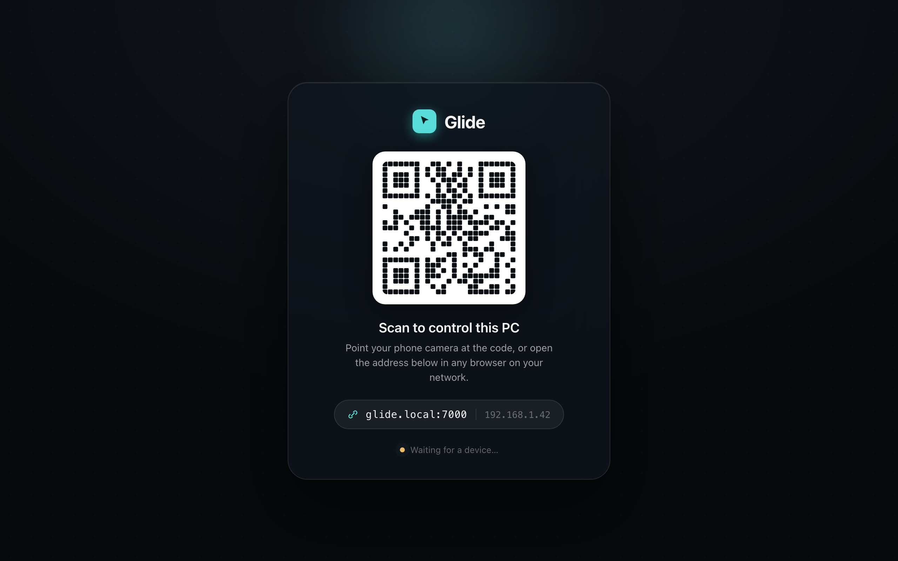
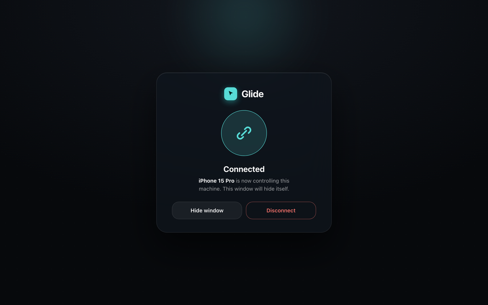
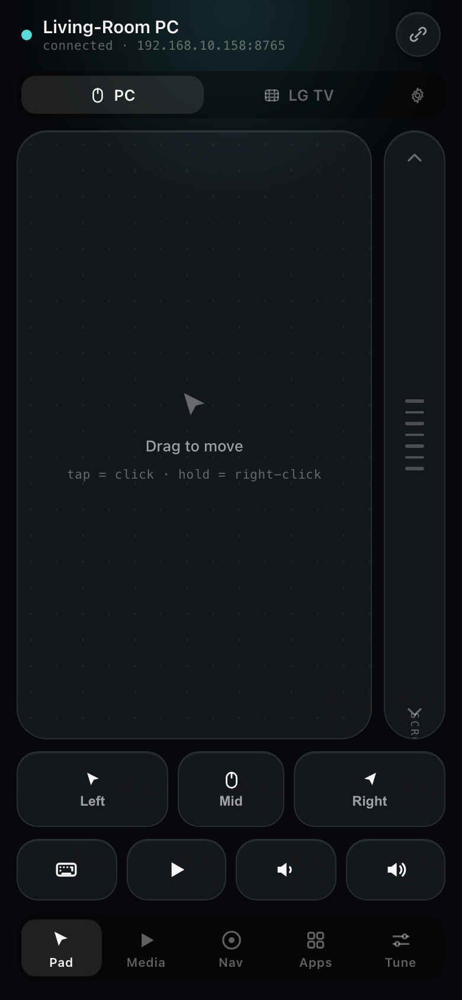
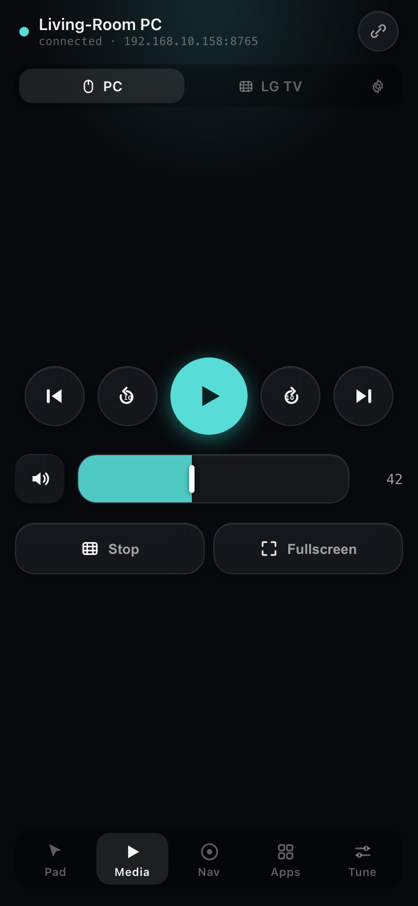
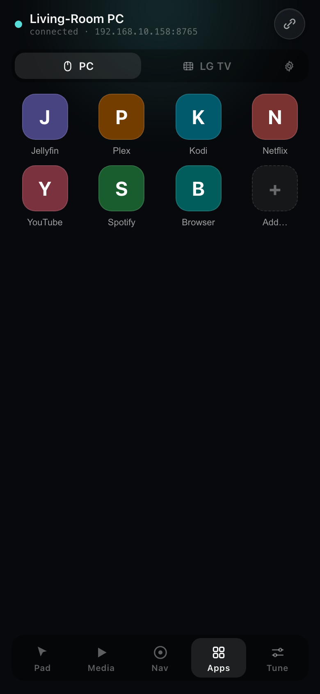
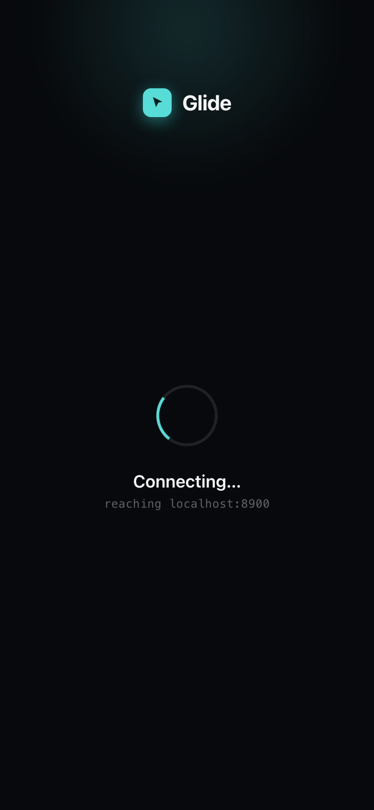

# Glide — HTPC Remote Control

> Turn any phone into a polished remote for your home theatre PC.  
> Scan a QR code. No app install. No pairing codes. Just works.



---

## What it does

Glide runs as a background service on your HTPC (**Linux** or **Windows**). When you log in, a glassmorphic popup appears on screen showing a QR code. Scan it with your phone — any browser on the same network will do — and you're in control. The popup disappears, your phone becomes the remote.

The popup is smart about when it comes back. Locking your phone, switching apps, or a brief network blip won't flash it up mid-film. It reappears on startup and again only after two hours of complete inactivity — useful for handing the remote to someone else.

- **Trackpad** with tap-to-click and a dedicated scroll strip (no flaky two-finger gestures)
- **Media controls** — play/pause, seek ±10s, next/prev, volume, mute, fullscreen
- **D-pad navigation** for Kodi, Netflix, anything full-screen
- **App launcher** — one tap to open Jellyfin, Plex, Kodi, Spotify, YouTube, browser
- **Text input** — native mobile keyboard, sends text directly to the focused field
- **Tune panel** — adjust pointer speed, scroll speed, and screen brightness from the remote
- **X11 and Wayland** — auto-detected at startup on Linux, no config needed

---

## Screenshots

<table>
<tr>
<td align="center" width="50%">

**HTPC — waiting for connection**


*Appears on login. Scan or type the URL.*

</td>
<td align="center" width="50%">

**HTPC — phone connected**



*Confirms which device took control. Auto-hides.*

</td>
</tr>
<tr>
<td align="center" width="50%">

**Phone — trackpad view**



*Drag to move. Tap to click. Right strip scrolls.*

</td>
<td align="center" width="50%">

**Phone — media controls**



*Swipe up or tap ⊞ to open. Prev / seek / play / seek / next + volume.*

</td>
</tr>
<tr>
<td align="center" width="50%">

**Phone — app launcher**



*One tap launches Jellyfin, Plex, Kodi, Netflix, YouTube, Spotify, or browser.*

</td>
<td align="center" width="50%">

**Phone — connecting**



*What you see the moment you open the URL. WebSocket connects automatically.*

</td>
</tr>
</table>

---

## Requirements

| | |
|---|---|
| **HTPC OS** | Linux (Debian · Ubuntu · Fedora · Arch · openSUSE) or Windows 10/11 |
| **Display server** | Linux: X11 or Wayland (auto-detected). Windows: native Win32 |
| **Python** | 3.9+ |
| **Phone** | Any browser on the same network — iOS Safari, Android Chrome, anything |

---

## Install

Download the latest release for your platform from the [**Releases page**](https://github.com/dnaidoo621/htpc-remote/releases/latest).

### Linux — Debian / Ubuntu (`.deb`)

```bash
sudo apt install ./htpc-remote_*_all.deb
```

Logs out and back in (or reboot). The QR popup appears on your next login.

### Linux — Fedora / RHEL / openSUSE (`.rpm`)

```bash
sudo dnf install ./htpc-remote-*.noarch.rpm      # Fedora / RHEL
sudo zypper install ./htpc-remote-*.noarch.rpm   # openSUSE
```

### Linux — Arch / Manjaro / other (`.tar.gz`)

```bash
tar xzf htpc-remote-*-linux.tar.gz
cd htpc-remote-*
bash install.sh
```

`install.sh` auto-detects your package manager (`apt` / `dnf` / `pacman` / `zypper`) and installs the right system packages before setting up the service.

All Linux installers will:
1. Create a Python virtual environment at `/opt/htpc-remote/venv`
2. Install FastAPI, uvicorn, pynput, and evdev (Linux only)
3. Add a udev rule so the Wayland backend can write to `/dev/uinput`
4. Enable and start a systemd user service for auto-start on login

### Windows (`.zip`)

1. Download `htpc-remote-*-windows.zip` from the [Releases page](https://github.com/dnaidoo621/htpc-remote/releases/latest)
2. Extract the ZIP anywhere
3. Open PowerShell in that folder and run:

```powershell
Set-ExecutionPolicy Bypass -Scope Process -Force
.\install-windows.ps1
```

The installer will:
1. Install Python 3.12 via `winget` if needed
2. Copy the app to `%LOCALAPPDATA%\htpc-remote`
3. Create a Python virtual environment and install dependencies
4. Register a Task Scheduler task that starts Glide silently at login

A QR overlay window will appear immediately. No reboot or log-out needed.

### Build from source (any platform, requires Docker)

```bash
git clone https://github.com/dnaidoo621/htpc-remote
cd htpc-remote

bash build-deb.sh 1.0.2    # → htpc-remote_1.0.2_all.deb
bash build-rpm.sh 1.0.2    # → htpc-remote-1.0.2-1.noarch.rpm
```

Both build scripts run inside an isolated Docker container (`debian:bookworm-slim` / `fedora:latest`) so your host OS doesn't matter.

---

## Usage

### Connecting from your phone

Once the service is running you'll see the QR popup on your TV/monitor. You have two options:

- **Scan the QR code** with your phone camera — it opens the URL automatically
- **Type the URL** shown under the code (e.g. `192.168.1.42:8765`) into any browser

The popup disappears once your phone connects. To reconnect, just reload the browser tab — the URL stays the same.

**Popup behaviour**

| Event | What happens |
|---|---|
| Service starts / login | Popup shows immediately |
| Phone connects | Popup hides |
| Phone locks or browser backgrounds | Nothing — popup stays hidden |
| Phone reconnects (reload tab) | Nothing — popup stays hidden |
| No device connected for 2 hours | Popup reappears automatically |

The 2-hour window resets every time any device connects. To change it, set `HTPC_REMOTE_IDLE_TIMEOUT` (in seconds) — see [Service management](#service-management) below.

### Add Glide to your home screen (optional)

The mobile UI is a **Progressive Web App**. Once you've opened it in your browser, you can save it as an icon on your phone so it's one tap away — no URL to remember, no browser chrome, just the remote.

**Android (Chrome):**  
Tap the three-dot menu → *Add to Home screen*. Or wait — Chrome often shows an install banner automatically after a few seconds.

**iPhone / iPad (Safari):**  
Tap the Share button (box with arrow) → *Add to Home Screen* → *Add*.

The icon that appears is the Glide teal cursor mark. Opening it launches straight into the controller with no address bar.

### Controls at a glance

| Gesture / button | Action |
|---|---|
| Drag on trackpad | Move mouse cursor |
| Tap on trackpad | Left click |
| Drag on scroll strip (right side) | Scroll |
| ▶ / ⏸ quick button | Play / Pause |
| 🔉 / 🔊 quick buttons | Volume down / up |
| ⊞ button → Media tab | Full media controls + seek |
| ⊞ button → Nav tab | D-pad + Back + Fullscreen |
| ⊞ button → Apps tab | App launcher |
| ⊞ button → Tune tab | Speed, brightness, sleep |
| ⌨ button | Open keyboard for text input |

---

## App launcher

| App | Linux | Windows |
|---|---|---|
| Jellyfin | `xdg-open http://localhost:8096` | `os.startfile` → default browser |
| Plex | `xdg-open https://app.plex.tv` | `os.startfile` → default browser |
| Kodi | `kodi` binary, or Flatpak | `kodi.exe` if installed |
| Netflix | `xdg-open https://www.netflix.com` | `os.startfile` → default browser |
| YouTube | `xdg-open https://www.youtube.com` | `os.startfile` → default browser |
| Spotify | `spotify` binary, or Flatpak | `spotify.exe` if installed |
| Browser | `firefox` → `chromium-browser` | `msedge.exe` → `chrome.exe` → `firefox.exe` |

To customise, edit `APP_COMMANDS` (Linux) or `APP_COMMANDS_WIN` (Windows) in `server/input/base.py`.

---

## Service management

### Linux (systemd)

```bash
# Status
systemctl --user status htpc-remote

# Restart
systemctl --user restart htpc-remote

# Live logs
journalctl --user -u htpc-remote -f

# Disable auto-start
systemctl --user disable htpc-remote
```

**Changing the idle timeout**

```bash
systemctl --user edit htpc-remote
```

Add:

```ini
[Service]
Environment=HTPC_REMOTE_IDLE_TIMEOUT=3600
```

Common values: `3600` = 1 hour · `7200` = 2 hours (default) · `0` = popup on every disconnect

### Windows (Task Scheduler)

```powershell
# Stop
Stop-ScheduledTask   -TaskName 'htpc-remote'

# Start
Start-ScheduledTask  -TaskName 'htpc-remote'

# Live logs
Get-Content "$env:LOCALAPPDATA\htpc-remote\htpc-remote.log" -Wait

# Remove
Unregister-ScheduledTask -TaskName 'htpc-remote' -Confirm:$false
```

To change the idle timeout on Windows, edit `HTPC_REMOTE_IDLE_TIMEOUT` in a `.env` file in the install directory, or set it as a user environment variable before starting the task.

---

## X11 vs Wayland vs Windows

| | X11 | Wayland | Windows |
|---|---|---|---|
| Mouse / click | pynput | evdev / uinput | pynput (Win32 VK) |
| Media keys | XF86 keysyms | Linux keycodes | `Key.media_*` VK codes |
| Text input | pynput type | wtype → ydotool → wl-copy | pynput type |
| Seek keys | XF86AudioRewind/Forward | `KEY_REWIND` / `KEY_FASTFORWARD` | Left / Right arrow |
| Sleep | XF86Sleep keysym | `KEY_SLEEP` | `rundll32 SetSuspendState` |
| Extra setup | None | `/dev/uinput` group | None |
| QR overlay | GTK3 | GTK3 | tkinter (stdlib) |

On Linux, Glide detects `$XDG_SESSION_TYPE` at startup and loads the right backend automatically. If you switch display servers, restart the service — no reinstall needed.

---

## Troubleshooting

**Popup doesn't appear on login (Linux)**

```bash
systemctl --user status htpc-remote
journalctl --user -u htpc-remote -b --no-pager
```

Most common cause: `DISPLAY` or `WAYLAND_DISPLAY` not set in the service environment. A reboot usually fixes it.

**Popup doesn't appear (Windows)**

```powershell
# Check the task is running
Get-ScheduledTask -TaskName 'htpc-remote' | Select-Object State
# Read the log
Get-Content "$env:LOCALAPPDATA\htpc-remote\htpc-remote.log" -Tail 50
```

**Phone can't reach the server**

- Make sure phone and HTPC are on the same Wi-Fi network
- Linux: `sudo ufw allow 8765/tcp` then `ss -tlnp | grep 8765`
- Windows: `netsh advfirewall firewall add rule name="Glide" dir=in action=allow protocol=TCP localport=8765`

**Wayland: mouse moves but keyboard/media keys don't work**

```bash
groups $USER  # should include 'input'

# If not:
sudo usermod -aG input $USER
# Then log out and back in, and restart the service
```

**Text input (Wayland) doesn't work**

```bash
sudo apt install wtype      # Debian / Ubuntu
sudo dnf install wtype      # Fedora
sudo pacman -S wtype        # Arch
```

---

## How it works

```
Phone browser  ──WebSocket──▶  FastAPI server (port 8765)
                                       │
                ┌──────────────────────┼──────────────────────┐
                ▼                      ▼                       ▼
         X11 (pynput)        Wayland (evdev/uinput)   Windows (pynput)
         XF86 keysyms        Linux keycodes            Win32 VK codes
```

The server translates incoming WebSocket messages into real input events using the platform's native API. The overlay (GTK3 on Linux, tkinter on Windows) is driven by the same server via a shared state object — it hides the moment a WebSocket client connects, and shows on startup or after 2 hours of inactivity. Brief disconnects are absorbed by a timer (`GLib.timeout_add_seconds` on Linux, `root.after` on Windows) that resets on every reconnect.

---

## Build & project structure

```
htpc-remote/
├── server/
│   ├── app.py            FastAPI + WebSocket handler
│   ├── overlay.py        GTK3 (Linux) + tkinter (Windows) QR popup
│   ├── main.py           Entry point (uvicorn thread + overlay main loop)
│   └── input/
│       ├── base.py       InputBackend ABC + APP_COMMANDS (Linux + Windows)
│       ├── x11.py        pynput backend (Linux X11)
│       ├── wayland.py    evdev/uinput backend (Linux Wayland)
│       └── windows.py    pynput + Win32 VK backend
├── web/
│   ├── index.html        Mobile UI entry point + PWA registration
│   ├── manifest.json     PWA manifest (name, icons, display mode)
│   ├── sw.js             Service worker — caches all static assets
│   └── static/
│       ├── glide-tokens.css      Design tokens (OLED dark, Pop!_OS teal)
│       ├── glide-ui.jsx          Icon set + shared primitives
│       ├── glide-connect.jsx     WS connection flow
│       ├── glide-controller.jsx  Full controller UI
│       ├── ws.js                 WebSocket manager + rAF batching
│       └── icons/                App icons (SVG + PNG for manifest + iOS)
├── packaging/
│   ├── DEBIAN/           .deb control files (postinst, prerm, postrm)
│   └── SPEC/             RPM spec file
├── .github/workflows/
│   └── release.yml       CI: builds .deb, .rpm, Windows .zip, Linux .tar.gz
├── build-deb.sh          One-command .deb builder (Docker)
├── build-rpm.sh          One-command .rpm builder (Docker)
├── install.sh            Universal Linux installer (apt/dnf/pacman/zypper)
└── install-windows.ps1   Windows installer (venv + Task Scheduler)
```

---

## Licence

MIT. Do what you like with it.
